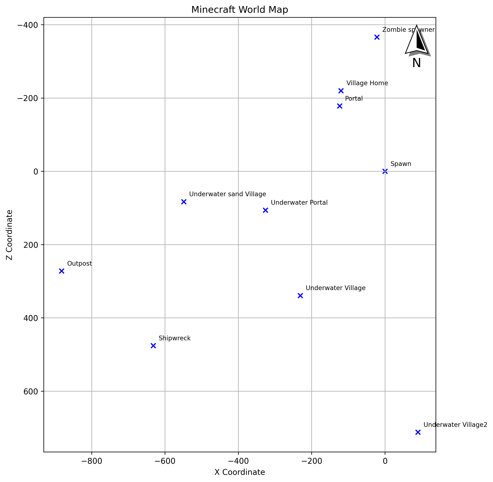

# Minecraft Map

Create a simple Minecraft schematic map from your notes.

## Usage:

This is my current game's coordinates notes:
```
Spawn: 0 / 0 / 0

Village Home: -120 / 94 / -220
Portal: -124 / 85 / -178

Zombie spawner: -22  / 23 / -366

Underwater Village: -231 / 62 / 339
Underwater Village2: 90 / 62 / 712
Shipwreck: -632 / 62 / 476
Outpost: -882 / 62 / 272
Underwater sand Village: -549 / 62 / 83
Underwater Portal: -326 / 62 / 106
```

After running `./mimap.py` you get this:
<center></center>

# TODO
Usage improvements:
- [ ] specify output file name (e.g. ~/mymap.png, mymap.png)
- [ ] output filename based on input file name, or some sane default for stdin and sample data
- [ ] doc install & run using uv
- [ ] allow duplicate labels
- [ ] allow plt.show() somehow
- [ ] file watch? 🤔
